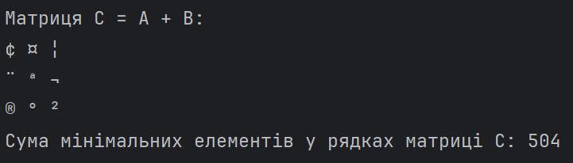
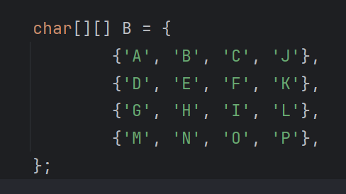
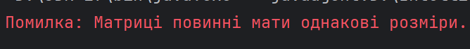
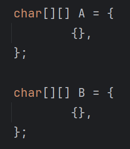
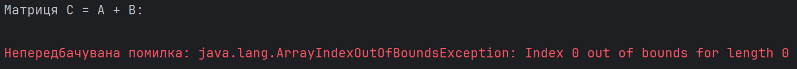
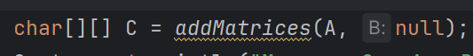
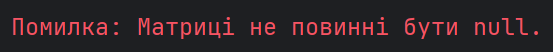

Завдання: Створити клас, який складається з виконавчого методу, що виконує дію з матрицею(ями) (C = A + B) із зазначеним типом елементів (char) та дію із результуючою матрицею С (Обчислити суму найменших елементів кожного рядка матриці). Вивести на екран результати першої та другої дій. Необхідно обробити всі виключні ситуації, що можуть виникнути під час виконання програмного коду. Всі змінні повинні бути описані та значення їх задані у виконавчому методі. Код повинен відповідати стандартам Java Code Conventions (або Google Java Style Guide) та бути завантаженим на GitHub.

У коді було наведено приклади двох матриць:

[a b c]

[d e f]

[g h i]

та

[A B C]

[D E F]

[G H I]

Метод addMatrices() додає матриці, елементи char фактично додаються як їхні числові коди Unicode, а потім знову приводяться до char.

Згідно з [таблицею ASCII](https://www.ascii-code.com/), у числовому вигляді матриці вигялдають так:

[97   98   99]

[100 101 102]

[103 104 105]

та

[65 66 67]

[68 69 70]

[71 72 73]

Додавши матриці та B, отримаємо такий результат:

[162 164 166]

[168 170 172]

[174 176 178]

Нова матриця С містить в собі такі символи:

[ ¢ ¤ ¦ ]

[ ¨ ª ¬ ]

[ ® ° ² ]

Сума найменших елементів кожного рядка матриці повинна бути 162 + 168 + 174 = 504. Запустимо програму та перевіримо її роботу з правильними матрицями:

Як бачимо, програма працює коректно. Заради експерименту зміню другу матрицю на матрицю розміром 4x4. 

Якщо зробити матриці пустими, то маємо такий exception:

Також поставимо null, наприклад, замість матриці B:

