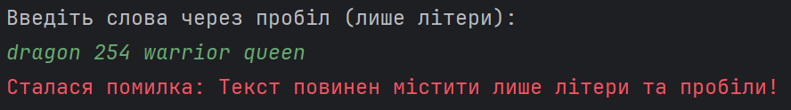
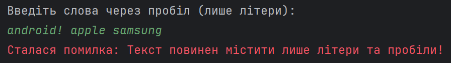
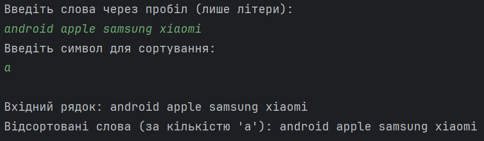
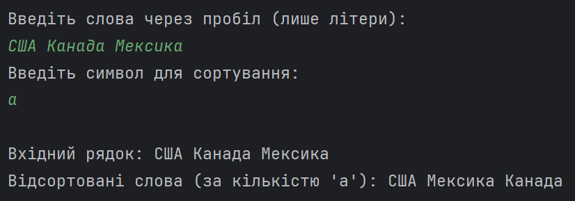
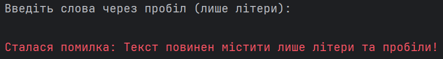
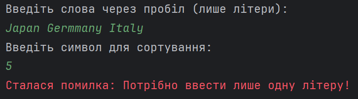
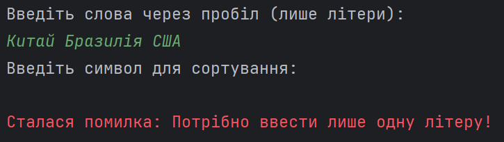

Завдання:

Створити клас, який складається з виконавчого методу, що виконує дію з текстовим рядком (Відсортувати слова заданого тексту за кількістю входжень визначеного символу в них) використовуючи для цього тип даних згідно варіанту (StringBuilder). Необхідно обробити всі виключні ситуації, що можуть виникнути під час виконання програмного коду. Всі змінні повинні бути описані та значення їх задані у виконавчому методі. Код повинен відповідати стандартам Java Code Conventions (або Google Java Style Guide) та бути завантаженим на GitHub.

При використанні типів даних StringBuilder та StringBuffer в цій лабораторній роботі необхідно для роботи з рядками використовувати тільки ці класи, перетворення зі StringBuilder (StringBuffer) в String і назад дозволяється робити тільки для введення і виведення даних.

Моя програма приймає лише слова, які використовують літери латиниці або крилиці, тобто якісь інші символи, такі як цифри та пунктуаційні знаки, програма не пропустить.

---

---

---

Спочатку сортування слів іде у порядку зростання по наявності літери, яку ми вводимо. Якщо кількість певної літери у двох словах однакова (напр. Ricardo та bath), то сортування відбувається по алфавітному порядку.

---

---

---

Також якщо не ввести нічого, то спрацює exception:

---

---

Або якщо замість символа для порівння ввести щось не те або нічого не ввести:

---

---

---

Завдання було виконано згідно з висунутою вимогою. Програма працює правильно, отже, робота зроблена правильно.