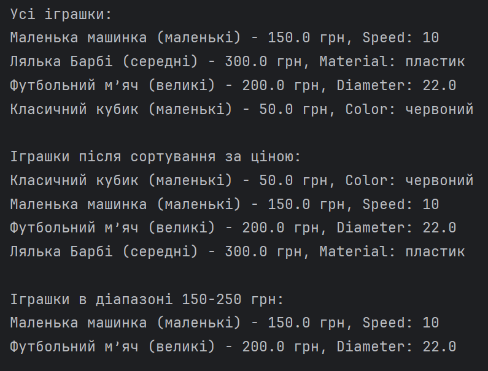
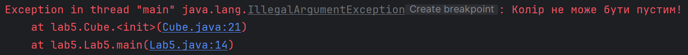
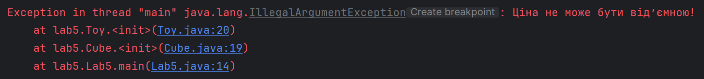

Завдання:
Визначити C13 як остачу від ділення порядковий номер студента у списку групи на 13.
12 % 13 = 12

Підготувати ігрову кімнату для дітей різних вікових груп. Іграшок повинно бути фіксована кількість у межах виділеної суми грошей. Повинні зустрічатися іграшки для різних вікових груп: маленькі, середні та великі машинки, ляльки, м'ячі, кубики. Провести сортування іграшок у кімнаті за будь-яким параметром. Знайти іграшку в кімнаті, що відповідає заданому діапазону вартості.

Створити узагальнений клас та не менше 3 класів-нащадків, що описують задану варіантом область знань. Створити клас, що складається з масиву об’єктів, з яким можна виконати вказані варіантом дії. Необхідно обробити всі виключні ситуації, що можуть виникнути під час виконання програмного коду. Код повинен бути детально задокументований. Код повинен відповідати стандартам Java Code Conventions (або Google Java Style Guide) та бути завантаженим на GitHub.

Отже, мною було створено клас Toy, від якого успадковуються Ball, Car, Cube, Doll.

У класі PlayRoom створено масив toys, який містить дані об'єкти та має методи для подальшої роботи з ними.

Покажу деякі моменти роботи програми.

---

---

У даному прикладі усе поставлено так, щоб програма працювала коректно. Виводиться список іграшок, список відсотрованих іграшок за ціною, а також іграшки в певному діапазоні.

Візьмемо, наприклад, і зробимо колір в кубика пустим
#### room.addToy(new Cube("Класичний кубик", 50, "маленькі", ""));

---

---

Або ж візьмемо мінусову ціну:
#### room.addToy(new Cube("Класичний кубик", -50, "маленькі", "червоний"));

---

---

Також було згенеровано файли для документації, які знаходяться в папці docs.